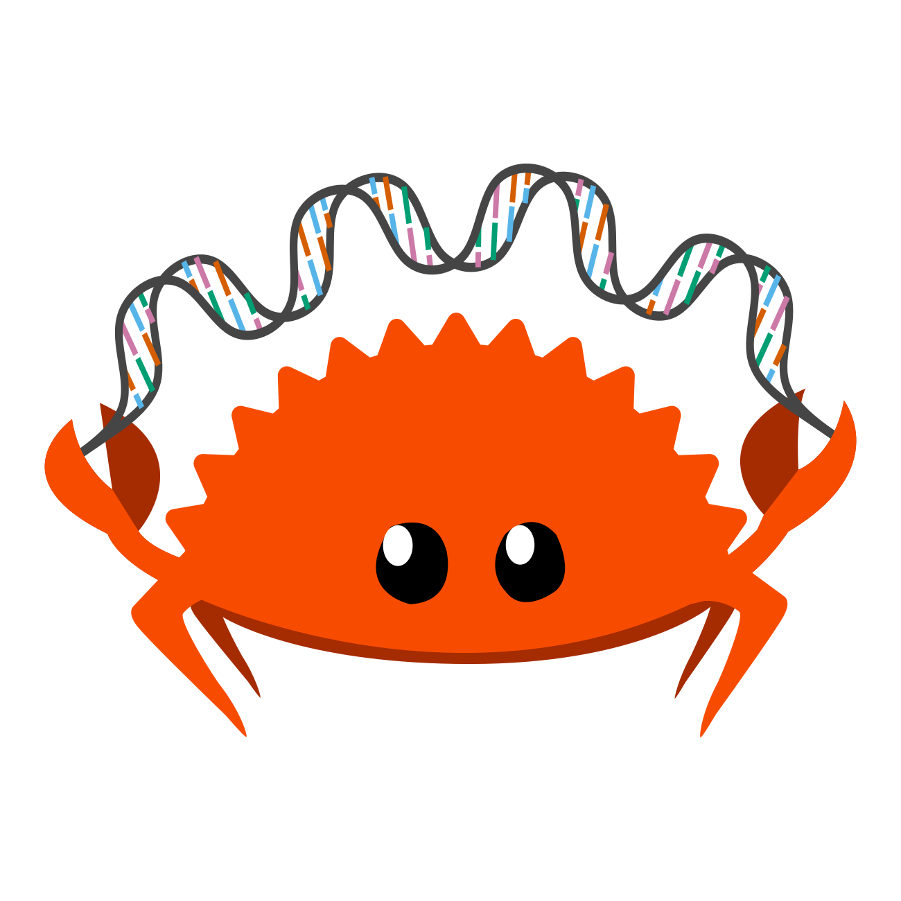
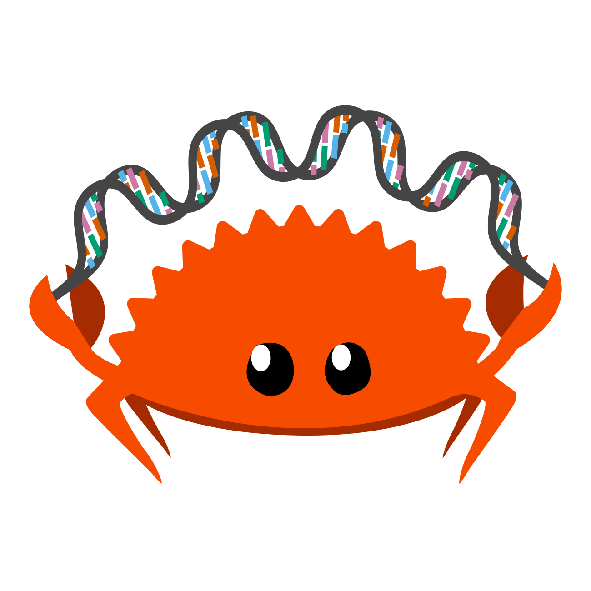
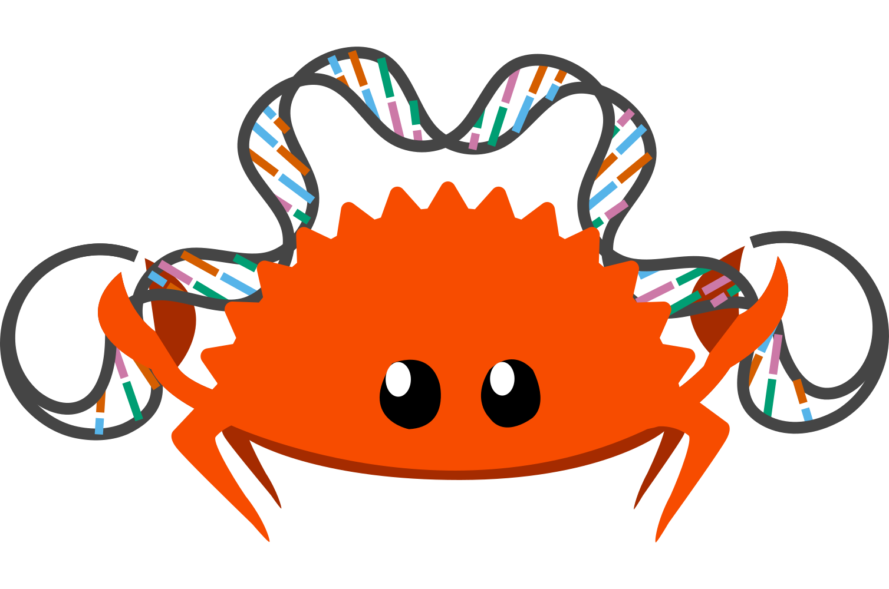

# Rust-Bio Logo

This logo for the [rust-bio](https://github.com/rust-bio/rust-bio) project is based on Ferris the Rustacean designed by [Karen Rustad Tölva](https://rustacean.net/).
Specifically, this logo is derived from the [Happy version of Ferris](https://rustacean.net/assets/rustacean-flat-happy.svg) (published under CC0 1.0).

The DNA sequence was added in Inkscape using the bend from clipboard option as described in this 
[graphic design stackexchange answer](https://graphicdesign.stackexchange.com/a/103086/53732).
The colors of the bases have been chosen from the [OkabeIto](https://jfly.uni-koeln.de/color/#pallet) colorblind barrier-free palette.

## Versions

Version 1, used as logo for the Discord channel:

Version 2, as version 1, but with thicker lines for the DNA:

Version 3, a variation with larger and more curled DNA:

The rust-bio logo is available under the MIT License to be in line with the remainder of the rust-bio project.

